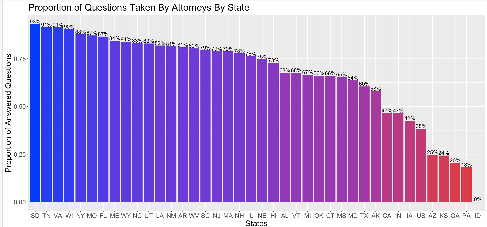
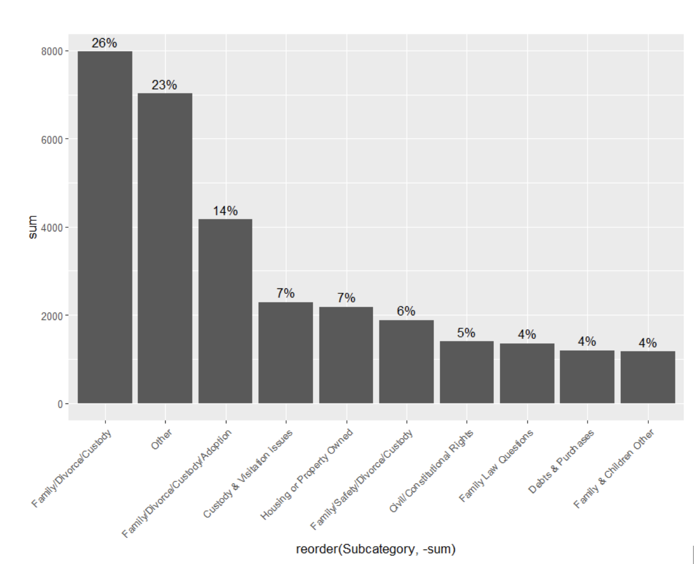
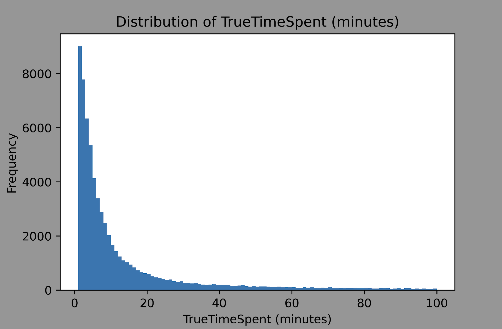
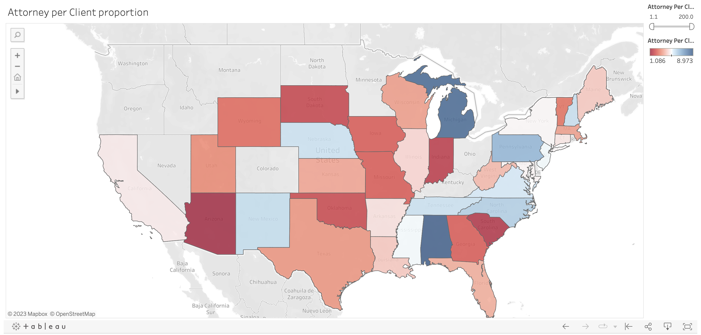
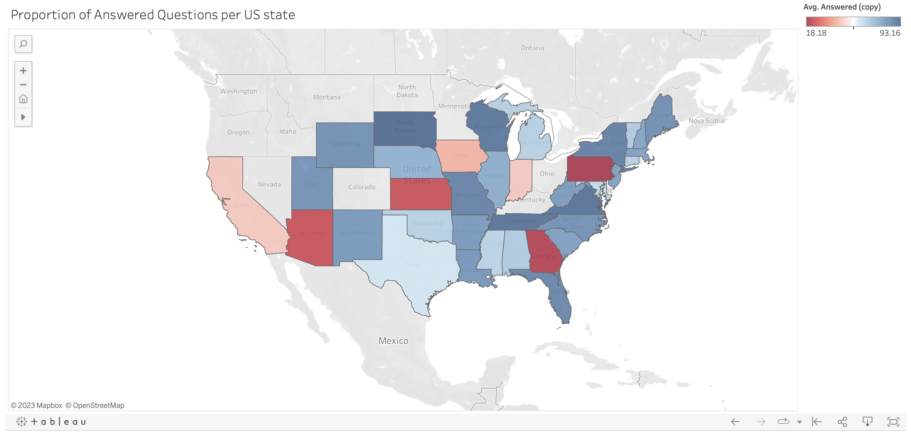

# DATAFEST 2023

This repository contains our findings for DataFest 2023. The datafest took place between April 21, 2023 and April 23, 2023 at Wesleyan University. The dataset used was provided by the American Bar Association.
 
 
The Research Question: The American Bar Association provides pro bono (i.e. free of charge) legal services across the
United States via an online platform available in some states and territories. The platform
allows people who qualify (based on state-based low-income status) to post legal questions
and receive legal advice from volunteer lawyers. The ABA would like to anticipate the sorts of
legal questions that arise so that they can prepare volunteers to address those questions,
better know how and when to recruit lawyers with specific expertise, and know how to advise
state partners on general trends they’re seeing.
 
 
Wrtten By: Nishant Aggarwal, Ayush Suri, Ahmad Alqemzi, Minji Woo, Evan Wacks, and Jake Gale.

# Overview

Our main focus in this presention is the <b>Efficency</b> and <b>Accessibility</b>.
 
<b>Accessibility:</b> Are people being able to get the help they need? Are their questions being answered? Is the service equally available in every state? Is there any way to improve this?
 
<b>Efficiency:</b> How much time does it take for lawyers to solve the issue? Are there some categories for which the question takes longer to resolve? Should the attorney be trained for certain categories in certain States? How can the resources be better allocated?

# Unanswered Questions

<b>Unanswered Question by State:</b>

We found that certain certain states have a huge proportion of questions going unanswered. This means that more Resources need to be allocated in these states to cover the people's need. The states with the lowest response rate are: Pennsylvania, Georgia, Kansas, Arizona, Iowa, Indiana and California. All of These have a response rate of less than 50%.
 
 
<b>Unanswered Question by Category: </b>
 

 
 
26% of the questions that are not being answered are coming from 1 category: Family/Divorce/Custody/Adoption (about 8000 unanswered)
33369 total Family/Divorce/Custody total (answered and unanswered questions).
That means around 25% of all Family/Divorce/Custody questions were unanswered.
 
 
14% of the questions that are not being answered are coming from another category: Family/Divorce/Custody/Adoption (about 4100 unanswered)
10969 total Family/Divorce/Custody total (answered and unanswered questions)
That means around 40% of all Family/Divorce/Custody/Adoption questions were unanswered.
 
 
Combining the two, (because they are very similar), we get:
40% of the questions that are not being answered are coming from the category: Family/Divorce/Custody/Adoption (about 12100 unanswered)
44338 total Family/Divorce/Custody total (answered and unanswered questions)
That means around 28% of all Family/Divorce/Custody/Adoption questions were unanswered.
 
 
<b>The Fine Tuned Image:</b>
 

Here is a link to a very customizable shiny: [Alluvial-By-State-By-Category-Answered-vs-Unanswered](https://n-aggarwal.shinyapps.io/Alluvial-By-State-By-Category-Answered-vs-Unanswered/). This will allow at the state level to see which categories are being not answered most frequently, and building upon that information allow them to allocate resources appropriately.

# Distribution of Time Spent on Questions

 
 

The true time of a given Question is defined by us as the time an Attorney takes on the case to the time of the last response from either party. This helps us to identify the amount of time the attorneys actually spent on the case-- eliminating the dead time that may come on either ends of the converstaion.
 
 
A very interesting thing to note about the distribution was the the difference in the mean and the median. The mean of the converstaion was 18 days (439.38 hours) while the median was less than 11 minutes (0.18 hours). We checked the data, and it turns out that majority (58%) of the Questions are resolved within 20 minutes. This means that these problems do not necessarily need an Attorney to be solved. They could be either solved by simply having more enhanced FAQ, or by having a paralegal or intern answer these questions instead (The ones they deem tough/long would be passed down to an attorney). This would help reallocate rescorces approriately, give attorneys more time to analyze more complex cases, and save money (paralegal's salary is less than attorney's salary), while also helping people gain experience in the field!

# Number of Lawyers by State

This goes back to the unanswered questions by state. The maps below show the number of attorneys per client grouped by state and the number of unanswered questions.

Interactive Versions: [Graph 1](https://public.tableau.com/app/profile/ahmad.khalfan.alqemzi/viz/Datafest2/Sheet2) and
[Graph 2](https://public.tableau.com/app/profile/ahmad.khalfan.alqemzi/viz/Datafest_16822636054530/Sheet13)
 

As you can see there is a (unsurprisingly) a clear (negative) correlation between the two: as the number of attorneys in a state decreases the number of unanswered questions increases. This is becasue if there are less attorneys in a state, then questions per attorney increases which can lead to one of two outcomes-- either the attorney's are not able to take on a huge chunk of the cases or they try to go through them very fast, and in that case may not be able to provide meaningfull feedback-- either way this is not a good outcome. A prime example of state that suffers from this problem is Georgia. More than 70% of questions go unanswered in Georgia and this is becasue it has some the highest cases per attorney- 100 for 1. So to make the services better in such states ABA needs to allocate more rescources and hire more attorneys to help people.
